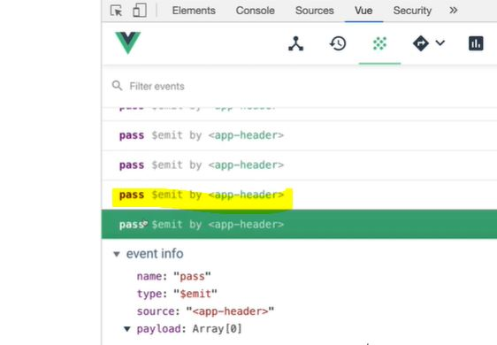

# 컴포넌트 통신 방식

### 컴포넌트 통신 방식
    
뷰 컴포넌트는 각각 고유한 데이터 유효 범위를 갖습니다. 따라서, 컴포넌트 간에 데이터를 주고 받기 위해선 아래와 같은 규칙을 따라야 합니다.

&#46; 상위에서 하위로는 데이터를 내려줌, 프롭스 속성  
&#46; 하위에서 상위로는 이벤트를 올려줌, 이벤트 발생

### 컴포넌트 통신 규칙이 필요한 이유

작업을 하다보면 헤더의 데이터가 바뀌면 로그인의 컴포넌트가 변화하는 등 n방향의 데이터 흐름이 생김  
이게 아주 여러개 생기다보면 데이터의 흐름을 파악할 수 없게 됨.  

그래서 규칙을 만들게 됨. 이제 우리는 처음에는 힘들지라도 항상 위에서 데이터(프롭스)가 내려오구나  
아래서 부모로 무언가 하려면 이벤트 emit을 해야하는 구나 규칙을 알고 사용하게 됨.

