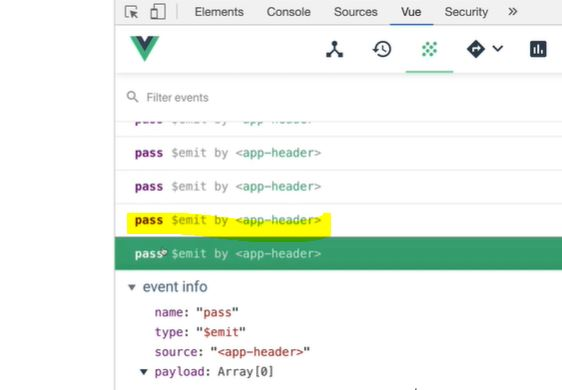

# event emit 개념

### event emit (자식이 부모에게 이벤트 방출하고 부모가 받기)

    

        // <app-header v-on:하위컴포넌트에서 발생한 이벤트 이름="상위 컴포넌트의 메서드"></app-header>
           <app-header v-on:pass="logText"></app-header>
    

    
    
 emit은 자식이 부모로 데이터를 보낼때 사용  
 버튼을 클릭하면 passEvent라는 메서드를 실행, 안을 들어가보니 pass라는 메서드를 실행하라고 함.  

### event logging

이벤트 이력(logging)을 확인할 수 있는 탭  
<app-header>컴포넌트로부터 pass라는 이벤트가 발생했다는 뜻

