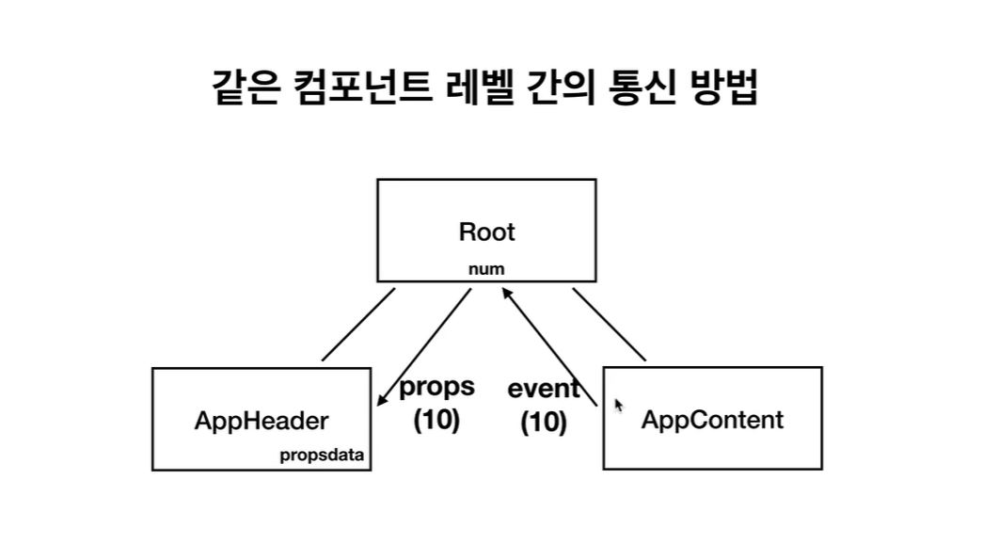

# 같은 레벨의 컴포넌트간의 데이터 통신 방법

### 부모로 보내고 다시 받고, 중간에 data를 통해서

   

       <app-header v-bind:propsdata="num"></app-header>
       <app-content v-on:pass="deliverNum"></app-content>
     

     
     

   

