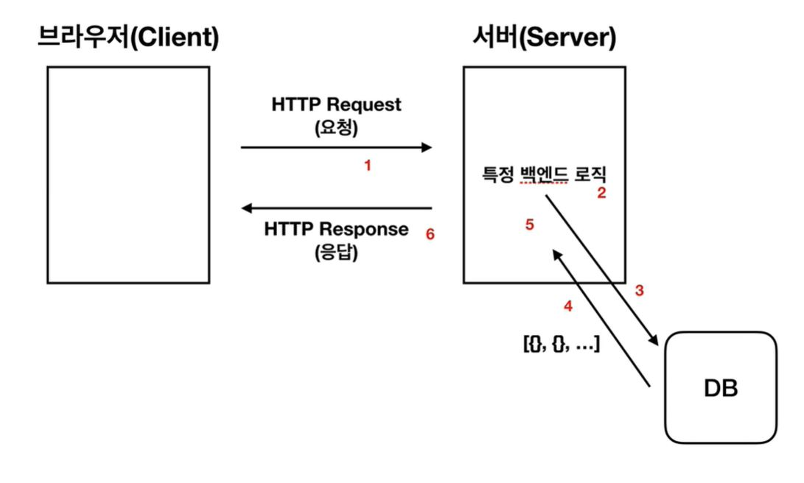

# HTTP 라이브러리와 Ajax 그리고 Vue Resource

####  액시오스 axios

 뷰에서 권고하는 promise 기반의 HTTP 통신 라이브러리. 
  
  
  
  
  
  
#### 에이젝스 ajax
  
화면에 변화가 생겼을때 서버에 html 파일 전체를 요청하는 것이 아니라 필요한 부분만 요청을 날려 변화된 일부만 데이터를 바꿀 수 있도록 하는 웹 개발 기법
  
  
  
  
  
#### 자바스크립트의 비동기 처리 패턴 진화 과정
1. callback
2. promise
3. promise + generator
4. async & await
  
참고  
ajax github : https://github.com/axios/axios  
자바스크립트 비동기 처리와 콜백 함수 : https://joshua1988.github.io/web-development/javascript/javascript-asynchronous-operation/  
자바스크립트 Promise 쉽게 이해하기 : https://joshua1988.github.io/web-development/javascript/promise-for-beginners/  
자바스크립트 async와 await : https://joshua1988.github.io/web-development/javascript/js-async-await/
  
  
  
  
  
#### 실습 코드
  
    

      <button v-on:click="getData">get user</button>
      

        {{ users }}
      

    

    
    
    
  
  
json 데이터 테스트 : https://jsonplaceholder.typicode.com  
js 동작원리 : https://joshua1988.github.io/web-development/translation/javascript/how-js-works-inside-engine/
  
  
  
  
  
#### 웹 서비스에서의 클라이언트와 서버와의 HTTP 통신 구조
  
  
  
  
  
  
프런트엔드 개발자가 알아야 하는 HTTP 프로토콜 : https://joshua1988.github.io/web-development/http-part1/
구글 크롬 개발자 도구 공식 문서 : https://developers.google.com/web/tools/chrome-devtools/
